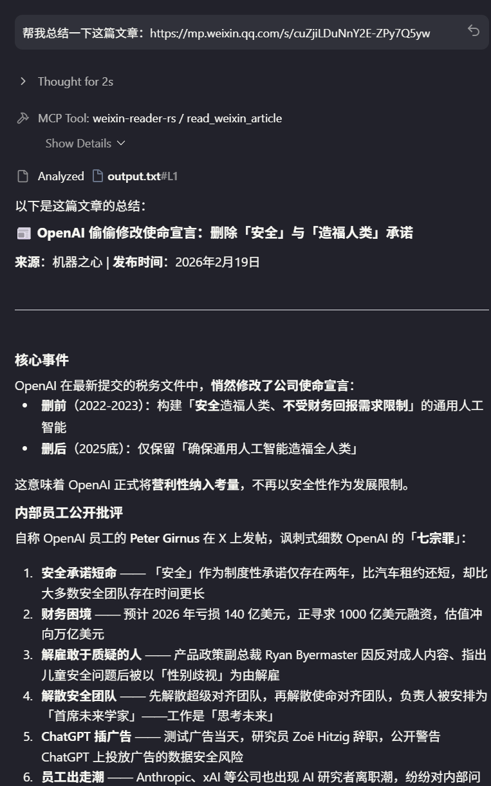

# Wechat Article Read MCP in Rust

[](./assets/readme_en.md)


一个基于 Rust 实现的 [MCP (Model Context Protocol)](https://modelcontextprotocol.io/) 服务器，用于读取微信公众号文章内容。

通过 headless Chrome 浏览器渲染微信文章页面，提取标题、作者、发布时间和正文内容，以结构化 JSON 格式返回给 AI 客户端（如 Claude Desktop）。

## 前言

目前多家业界最佳的大模型厂商如Gemini,Claude,Minimax虽然都有联网搜索功能，但是由于微信公众号的反爬机制，并不能提取到文章内容，本项目旨在赋予LLM实际读取微信公众号文章的能力。

受项目[weixin-read-mcp](https://github.com/Bwkyd/wexin-read-mcp)的启发，本项目使用Rust实现，优势在于：

1. 🚀 启动速度 — 编译为原生二进制，无需 Python 解释器和虚拟环境，MCP 服务冷启动从数秒降至毫秒级
2. 📦 分发简便 — 单个可执行文件，无需用户安装 Python / pip / venv
3. 💾 内存占用 — Rust 无 GC 开销，整体内存占用更低
4. 🔒 类型安全 — 编译期保证类型正确，杜绝运行时类型错误
5. ⚡ 解析性能 — HTML 解析和文本处理在 Rust 中显著更快

## 示例

二进制文件即插即用：


## ✨ 特性

- **单一二进制** — 无需 Python 环境，编译后即可分发
- **MCP 协议** — 通过 stdio JSON-RPC 与 AI 客户端集成
- **浏览器渲染** — 使用 Chrome DevTools Protocol 获取 JavaScript 渲染后的完整页面
- **结构化提取** — CSS 选择器精准提取文章元数据和正文

## 🏗️ 架构

```
AI Client (Claude Desktop)
    ↕ stdio JSON-RPC (MCP 协议)
main.rs → server.rs → scraper.rs → parser.rs
                          ↕ CDP
                    Chromium (headless)
                          ↓ HTTP
                   mp.weixin.qq.com
```

| 模块 | 职责 |
|------|------|
| `main.rs` | 程序入口，初始化日志和 MCP 服务 |
| `server.rs` | MCP 工具注册，URL 校验，响应构造 |
| `scraper.rs` | headless Chrome 生命周期管理，页面导航 |
| `parser.rs` | HTML 解析，CSS 选择器提取结构化数据 |
| `error.rs` | 统一错误类型定义 |

## 📋 前置条件

1. **Rust 工具链**

   ```bash
   curl --proto '=https' --tlsv1.2 -sSf https://sh.rustup.rs | sh
   ```

2. **Chrome 或 Chromium 浏览器**

   ```bash
   # Ubuntu/Debian
   sudo apt install chromium-browser

   # macOS
   brew install --cask chromium

   # Windows
   # 安装 Chrome 浏览器即可
   ```

## 🔨 编译

```bash
# 开发构建
cargo build

# 发布构建（优化，推荐用于部署）
cargo build --release
```

> **注意**: 首次编译 `chromiumoxide` 较慢（约 60K 行 CDP 代码），后续增量编译会快很多。

## 🚀 使用

### 配置 Claude Desktop/Antigravity/Cursor等

编辑相关的配置文件：

```json
{
  "mcpServers": {
    "weixin-reader": {
      //in windows
      "command": "/path/to/weixin-mcp-rs.exe"
      //in linux
      //"command": "/path/to/weixin-mcp-rs"
    }
  }
}
```

将 `/path/to/` 替换为实际的项目路径。

### 本地测试

```bash
# 直接运行（等待 stdin 的 JSON-RPC 输入）
cargo run

# 发送 MCP 初始化请求测试
echo '{"jsonrpc":"2.0","id":1,"method":"initialize","params":{"protocolVersion":"2024-11-05","capabilities":{},"clientInfo":{"name":"test","version":"0.1.0"}}}' | cargo run 2>/dev/null
```

### MCP 工具说明

| 工具名 | 参数 | 说明 |
|--------|------|------|
| `read_weixin_article` | `url: string` | 读取微信公众号文章，URL 必须以 `https://mp.weixin.qq.com/s/` 开头 |

**返回格式**:

```json
{
  "success": true,
  "title": "文章标题",
  "author": "作者名",
  "publish_time": "2024-01-01",
  "content": "文章正文...",
  "error": null
}
```

## 🔧 常见问题

| 问题 | 原因 | 解决方案 |
|------|------|---------|
| 找不到 Chrome | 系统未安装 Chrome | 安装 Chrome，或设置 `CHROME` 环境变量指向可执行文件 |
| MCP 启动后无响应 | stdout 被日志污染 | 日志已配置输出到 stderr，检查是否有其他 print 语句 |
| `find_element` 超时 | 页面加载慢 / 非微信文章页 | 确认 URL 是有效的微信文章链接 |
| 文章内容为空 | 微信反爬虫 | 降低请求频率 |
