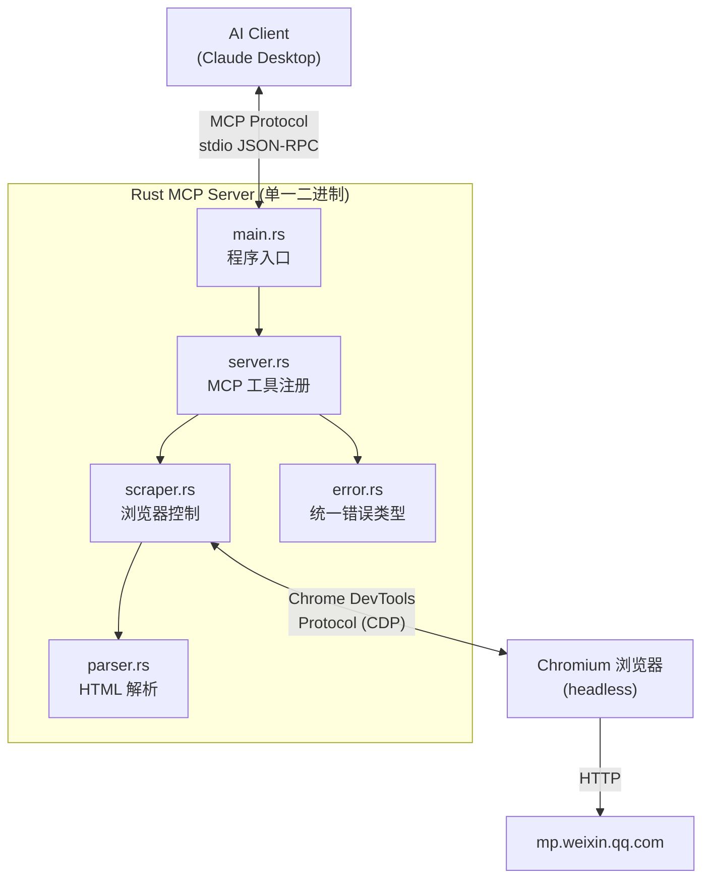

# Weixin MCP Rust 重写 —— 完整开发指导文档

## 1. 整体架构

### 1.1 架构图



### 1.2 数据流

```
AI Client 发送请求
    ↓ (stdio JSON-RPC)
main.rs: tokio 异步运行时启动 MCP 服务
    ↓
server.rs: read_weixin_article tool 被调用，接收 url 参数
    ↓ URL 校验
scraper.rs: 启动/复用 headless Chrome，导航到 URL，等待页面加载
    ↓ 获取渲染后的 HTML
parser.rs: CSS 选择器提取标题、作者、时间、正文
    ↓ 返回结构化 JSON
server.rs: 包装为 CallToolResult 返回
    ↓ (stdio JSON-RPC)
AI Client 接收结果
```

### 1.3 与 Python 版本的对应关系

| Python 文件 | Rust 文件 | 说明 |
|-------------|-----------|------|
| `src/server.py` | `src/main.rs` + `src/server.rs` | Rust 中将入口和业务逻辑分开 |
| `src/scraper.py` | `src/scraper.rs` | Playwright → chromiumoxide |
| `src/parser.py` | `src/parser.rs` | BeautifulSoup → scraper crate |
| *(无)* | `src/error.rs` | Rust 需要显式定义错误类型 |

---

## 2. 项目初始化

### 2.1 创建项目

```bash
cargo init weixin-mcp-rs
cd weixin-mcp-rs
```

### 2.2 目录结构

```
weixin-mcp-rs/
├── Cargo.toml              # 项目配置与依赖
├── src/
│   ├── main.rs             # 程序入口：启动 tokio 运行时 + MCP 服务
│   ├── server.rs           # MCP 工具定义：WeixinServer 结构体 + #[tool] 方法
│   ├── scraper.rs          # 浏览器自动化：管理 Chrome 生命周期、页面导航
│   ├── parser.rs           # HTML 内容解析：CSS 选择器提取结构化数据
│   └── error.rs            # 统一错误类型定义
└── README.md
```

### 2.3 Cargo.toml 完整配置

```toml
[package]
name = "weixin-mcp-rs"
version = "0.1.0"
edition = "2021"
description = "MCP server for reading WeChat articles - Rust implementation"

[dependencies]
# MCP 协议 SDK（Anthropic 官方 Rust 实现）
rmcp = { version = "0.16", features = [
    "server",                    # 服务端功能
    "macros",                    # #[tool] 等宏
    "transport-io",              # stdio 传输
] }

# 浏览器自动化（通过 Chrome DevTools Protocol）
chromiumoxide = { version = "0.8", features = ["tokio-runtime"], default-features = false }
futures = "0.3"                  # chromiumoxide handler 需要 StreamExt

# HTML 解析（CSS 选择器）
scraper = "0.22"

# 正则表达式（清理文本）
regex = "1"

# 异步运行时
tokio = { version = "1", features = ["full"] }

# 序列化
serde = { version = "1", features = ["derive"] }
serde_json = "1"

# JSON Schema 生成（rmcp tool 参数需要）
schemars = "0.8"

# 日志
tracing = "0.1"
tracing-subscriber = "0.3"

# 错误处理
thiserror = "2"
```

> [!IMPORTANT]
> `chromiumoxide` 需要系统安装了 Chrome 或 Chromium 浏览器。与 Playwright 不同，它不会自动下载浏览器。在部署说明中需要提醒用户安装 Chrome。

---

## 3. 各文件详细实现指导

---

### 3.1 `src/error.rs` — 统一错误类型

**作用**: 定义项目级别的统一错误枚举，所有模块的错误统一转换为此类型。

**为什么需要**: Rust 没有异常机制，所有错误通过 `Result<T, E>` 传递。定义统一错误类型后可以用 `?` 操作符在函数间自动传播错误。

```rust
use thiserror::Error;

#[derive(Error, Debug)]
pub enum AppError {
    /// URL 格式不正确
    #[error("Invalid URL format: {0}. Must be https://mp.weixin.qq.com/s/xxx")]
    InvalidUrl(String),

    /// 浏览器操作失败
    #[error("Browser error: {0}")]
    BrowserError(String),

    /// 页面加载超时
    #[error("Page load timeout: {0}")]
    Timeout(String),

    /// HTML 解析失败
    #[error("Parse error: {0}")]
    ParseError(String),

    /// chromiumoxide 错误
    #[error("Chromium error: {0}")]
    ChromiumError(#[from] chromiumoxide::error::CdpError),
}
```

**要点**:

- 使用 `thiserror` crate 的 `#[derive(Error)]` 自动生成 `std::error::Error` 实现
- `#[from]` 属性为 `chromiumoxide::error::CdpError` 自动生成 `From` trait，允许用 `?` 直接转换
- 每个变体对应一类业务错误

---

### 3.2 `src/parser.rs` — HTML 内容解析器

**作用**: 接收渲染后的 HTML 字符串，使用 CSS 选择器提取微信文章的标题、作者、发布时间和正文内容。

**对标 Python**: 替代 `BeautifulSoup` + `re` 模块。

#### 完整实现逻辑

```rust
use scraper::{Html, Selector};
use regex::Regex;
use serde::{Serialize, Deserialize};

/// 解析后的文章数据
#[derive(Debug, Serialize, Deserialize, Clone)]
pub struct ArticleData {
    pub title: String,
    pub author: String,
    pub publish_time: String,
    pub content: String,
}

/// 微信文章 HTML 解析器
pub struct WeixinParser;

impl WeixinParser {
    pub fn new() -> Self {
        Self
    }

    /// 解析微信文章 HTML，提取结构化数据
    ///
    /// # Arguments
    /// * `html` - 页面完整 HTML 内容（须是浏览器渲染后的 DOM）
    ///
    /// # Returns
    /// `ArticleData` 包含标题、作者、时间、正文
    pub fn parse(&self, html: &str) -> ArticleData {
        let document = Html::parse_document(html);

        let title = self.extract_title(&document);
        let author = self.extract_author(&document);
        let publish_time = self.extract_publish_time(&document);
        let content = self.extract_content(&document);

        ArticleData {
            title,
            author,
            publish_time,
            content,
        }
    }

    /// 提取标题
    /// 微信文章标题在 <h1 id="activity-name"> 中
    fn extract_title(&self, doc: &Html) -> String {
        let selector = Selector::parse("h1#activity-name").unwrap();
        doc.select(&selector)
            .next()
            .map(|el| el.text().collect::<Vec<_>>().join("").trim().to_string())
            .unwrap_or_else(|| "未找到标题".to_string())
    }

    /// 提取作者
    /// 优先从 <span id="js_author_name"> 获取，
    /// 回退到 <a id="js_name">（公众号名称）
    fn extract_author(&self, doc: &Html) -> String {
        // 先尝试作者名
        let author_sel = Selector::parse("span#js_author_name").unwrap();
        if let Some(el) = doc.select(&author_sel).next() {
            let text = el.text().collect::<Vec<_>>().join("").trim().to_string();
            if !text.is_empty() {
                return text;
            }
        }

        // 回退到公众号名称
        let name_sel = Selector::parse("a#js_name").unwrap();
        doc.select(&name_sel)
            .next()
            .map(|el| el.text().collect::<Vec<_>>().join("").trim().to_string())
            .unwrap_or_else(|| "未知作者".to_string())
    }

    /// 提取发布时间
    /// 微信文章时间在 <em id="publish_time"> 中
    fn extract_publish_time(&self, doc: &Html) -> String {
        let selector = Selector::parse("em#publish_time").unwrap();
        doc.select(&selector)
            .next()
            .map(|el| el.text().collect::<Vec<_>>().join("").trim().to_string())
            .unwrap_or_else(|| "未知时间".to_string())
    }

    /// 提取正文内容
    /// 微信正文在 <div id="js_content"> 中
    /// 需要移除 script/style 标签，清理多余空白
    fn extract_content(&self, doc: &Html) -> String {
        let content_sel = Selector::parse("div#js_content").unwrap();
        let script_sel = Selector::parse("script").unwrap();
        let style_sel = Selector::parse("style").unwrap();

        match doc.select(&content_sel).next() {
            Some(content_el) => {
                // 收集所有文本节点，排除 script 和 style 的内容
                // 注意：scraper crate 不支持 decompose（就地删除节点），
                // 所以我们用另一种方式：获取 inner_html，重新解析后过滤
                let inner_html = content_el.inner_html();
                let fragment = Html::parse_fragment(&inner_html);

                // 收集需要排除的节点 ID
                let script_ids: Vec<_> = fragment.select(&script_sel)
                    .map(|el| el.id())
                    .collect();
                let style_ids: Vec<_> = fragment.select(&style_sel)
                    .map(|el| el.id())
                    .collect();

                // 提取文本，跳过 script/style 节点及其子节点
                let text: String = fragment.root_element()
                    .text()
                    .collect::<Vec<_>>()
                    .join("\n");

                // 如果 script/style 标签内有文本，用更精细的方式过滤：
                // 简化方案：先提取纯文本，再清理
                self.clean_text(&text)
            }
            None => "未找到正文内容".to_string(),
        }
    }

    /// 清理文本内容
    /// - 合并连续 3 个以上换行为 2 个
    /// - 合并连续 2 个以上空格为 1 个
    fn clean_text(&self, text: &str) -> String {
        let re_newlines = Regex::new(r"\n{3,}").unwrap();
        let re_spaces = Regex::new(r" {2,}").unwrap();

        let text = re_newlines.replace_all(text, "\n\n");
        let text = re_spaces.replace_all(&text, " ");

        text.trim().to_string()
    }
}
```

**关键差异与注意事项**:

1. **`scraper` vs `BeautifulSoup`**: `scraper` 的选择器语法是标准 CSS 选择器，与 BS4 的 `find` 方法不同但更强大
2. **文本提取**: BS4 的 `get_text(separator='\n', strip=True)` 在 Rust 中需要手动用 `.text()` 迭代器收集
3. **Regex 编译**: 生产代码中应使用 `lazy_static!` 或 `std::sync::OnceLock` 预编译正则，避免每次调用都编译

> [!TIP]
> **性能优化建议**: 使用 `std::sync::OnceLock` 缓存编译后的 `Regex` 和 `Selector`，避免重复编译：
>
> ```rust
> use std::sync::OnceLock;
> 
> fn title_selector() -> &'static Selector {
>     static SEL: OnceLock<Selector> = OnceLock::new();
>     SEL.get_or_init(|| Selector::parse("h1#activity-name").unwrap())
> }
> ```

---

### 3.3 `src/scraper.rs` — 浏览器自动化模块

**作用**: 管理 headless Chrome 浏览器的生命周期，负责导航到微信文章 URL、等待页面渲染完成、获取渲染后的 HTML。

**对标 Python**: 替代 Playwright 的 `async_playwright().start()` → `browser.new_context()` → `page.goto()` 等。

#### chromiumoxide 核心概念

| chromiumoxide | Playwright (Python) | 说明 |
|---------------|---------------------|------|
| `Browser::launch()` | `playwright.chromium.launch()` | 启动浏览器，返回 `(Browser, Handler)` |
| `Handler` | *(无对应)* | **必须在后台 tokio task 中持续运行**，处理 CDP 事件循环 |
| `browser.new_page(url)` | `context.new_page()` + `page.goto()` | 创建新页面并导航 |
| `page.find_element(sel)` | `page.wait_for_selector()` | 等待并查找元素 |
| `page.content()` | `page.content()` | 获取页面 HTML |

> [!WARNING]
> **Handler 必须后台运行**: `chromiumoxide` 的设计要求 `Handler` 在独立的 tokio task 中运行事件循环。如果 handler 停止，所有浏览器操作都会挂起。这是与 Playwright 最大的设计差异。

#### 完整实现逻辑

```rust
use chromiumoxide::{Browser, BrowserConfig, Page};
use futures::StreamExt;
use tokio::sync::OnceCell;
use tokio::task::JoinHandle;
use std::sync::Arc;
use std::time::Duration;

use crate::error::AppError;
use crate::parser::{WeixinParser, ArticleData};

/// 浏览器管理器
/// 
/// 负责管理 headless Chrome 实例的生命周期。
/// 浏览器实例在首次使用时懒初始化，后续复用。
pub struct WeixinScraper {
    parser: WeixinParser,
    /// 浏览器实例（懒初始化）
    browser: OnceCell<BrowserState>,
}

/// 浏览器运行状态
struct BrowserState {
    browser: Browser,
    /// handler 必须在后台持续运行，drop 时自动终止
    _handler_task: JoinHandle<()>,
}

impl WeixinScraper {
    pub fn new() -> Self {
        Self {
            parser: WeixinParser::new(),
            browser: OnceCell::new(),
        }
    }

    /// 确保浏览器已初始化（懒加载模式）
    async fn ensure_browser(&self) -> Result<&Browser, AppError> {
        let state = self.browser.get_or_try_init(|| async {
            // 配置浏览器
            let config = BrowserConfig::builder()
                .no_sandbox()                 // Docker 环境可能需要
                .window_size(1920, 1080)
                .arg("--disable-blink-features=AutomationControlled")
                .build()
                .map_err(|e| AppError::BrowserError(format!("Config error: {}", e)))?;

            // 启动浏览器
            let (browser, mut handler) = Browser::launch(config)
                .await
                .map_err(|e| AppError::BrowserError(format!("Launch error: {}", e)))?;

            // handler 必须在后台持续运行！
            // 它负责处理 CDP 协议的事件循环
            let handler_task = tokio::spawn(async move {
                while let Some(_event) = handler.next().await {
                    // 处理浏览器事件（可选：在此处记录日志）
                }
            });

            Ok(BrowserState {
                browser,
                _handler_task: handler_task,
            })
        }).await?;

        Ok(&state.browser)
    }

    /// 获取微信文章内容
    ///
    /// # Arguments
    /// * `url` - 微信文章 URL
    ///
    /// # Returns
    /// `ArticleData` 或错误
    pub async fn fetch_article(&self, url: &str) -> Result<ArticleData, AppError> {
        let browser = self.ensure_browser().await?;

        // 创建新页面并导航
        let page = browser.new_page(url)
            .await
            .map_err(|e| AppError::BrowserError(format!("New page error: {}", e)))?;

        // 等待关键元素 #js_content 加载
        // chromiumoxide 的 find_element 会自动等待元素出现
        page.find_element("div#js_content")
            .await
            .map_err(|e| AppError::Timeout(format!(
                "Waiting for #js_content failed: {}. The page may not be a valid WeChat article.", e
            )))?;

        // 获取渲染后的完整 HTML
        let html = page.content()
            .await
            .map_err(|e| AppError::BrowserError(format!("Get content error: {}", e)))?;

        // 关闭页面（释放资源）
        page.close().await
            .map_err(|e| AppError::BrowserError(format!("Close page error: {}", e)))?;

        // 解析 HTML
        let article = self.parser.parse(&html);

        Ok(article)
    }
}
```

**关键实现细节**:

1. **懒初始化**: 使用 `tokio::sync::OnceCell` 确保浏览器只启动一次，后续请求复用。对标 Python 版中 `initialize()` 方法的 `if not self.browser` 检查
2. **Handler 后台运行**: 这是 `chromiumoxide` 与 Playwright 最大的区别。`Handler` 必须在独立 tokio task 中持续运行 `while let Some(_) = handler.next().await`
3. **User-Agent**: `BrowserConfig` 不直接支持设置 User-Agent，可以通过 CDP 命令 `page.execute(...)` 设置，或使用 `--user-agent=...` 作为启动参数
4. **超时控制**: `chromiumoxide` 的 `find_element` 有内置超时。如需自定义超时，可用 `tokio::time::timeout` 包裹

> [!NOTE]
> **与 Playwright 的等待策略差异**: Playwright 的 `wait_until='networkidle'` 在 chromiumoxide 中没有直接对应。`new_page(url)` 默认等待页面 `load` 事件。对于微信文章，等待 `#js_content` 元素出现通常已足够。

---

### 3.4 `src/server.rs` — MCP 服务器定义

**作用**: 定义 MCP 服务器，注册 `read_weixin_article` 工具，处理请求和构造响应。

**对标 Python**: 替代 `fastmcp` 的 `@mcp.tool()` 装饰器模式。

#### rmcp 核心概念

| rmcp (Rust) | fastmcp (Python) | 说明 |
|-------------|-------------------|------|
| `#[derive(Clone)] struct Server` | `mcp = FastMCP("name")` | 服务器结构体 |
| `#[tool_router] impl Server` | *(自动)* | 定义工具路由 |
| `#[tool(description = "...")]` | `@mcp.tool()` | 注册工具方法 |
| `#[tool_handler] impl ServerHandler` | *(自动)* | 实现 MCP 协议处理 |
| `CallToolResult::success(...)` | `return {"success": True, ...}` | 返回工具结果 |

#### 完整实现逻辑

```rust
use rmcp::{
    ServerHandler, ServiceExt,
    handler::server::tool::ToolRouter,
    model::*,
    tool, tool_handler, tool_router,
    transport::stdio,
    ErrorData as McpError,
};
use serde::{Serialize, Deserialize};
use tracing;

use crate::scraper::WeixinScraper;

/// MCP 服务器结构体
///
/// 持有浏览器爬虫实例和工具路由。
/// 必须实现 Clone（rmcp 要求）。
#[derive(Clone)]
pub struct WeixinServer {
    /// 爬虫实例，Arc 包裹以支持 Clone
    scraper: std::sync::Arc<WeixinScraper>,
    /// 工具路由（由 #[tool_router] 宏自动生成）
    tool_router: ToolRouter<Self>,
}

/// 工具方法定义
///
/// #[tool_router] 宏会扫描此 impl 块中的所有 #[tool] 方法，
/// 自动生成路由表。
#[tool_router]
impl WeixinServer {
    /// 创建新的服务器实例
    pub fn new() -> Self {
        Self {
            scraper: std::sync::Arc::new(WeixinScraper::new()),
            tool_router: Self::tool_router(), // 宏生成的方法
        }
    }

    /// 读取微信公众号文章内容
    ///
    /// 接收一个微信文章 URL，使用浏览器渲染页面并提取结构化内容。
    /// URL 必须以 https://mp.weixin.qq.com/s/ 开头。
    #[tool(description = "读取微信公众号文章内容\n\nArgs:\n    url: 微信文章URL，格式: https://mp.weixin.qq.com/s/xxx\n\nReturns:\n    dict: {\n        \"success\": bool,\n        \"title\": str,\n        \"author\": str,\n        \"publish_time\": str,\n        \"content\": str,\n        \"error\": str | None\n    }")]
    async fn read_weixin_article(
        &self,
        #[tool(param)]
        url: String,
    ) -> Result<CallToolResult, McpError> {
        // 1. URL 校验
        if !url.starts_with("https://mp.weixin.qq.com/s/") {
            let error_msg = format!(
                "Invalid URL format. Must be a Weixin article URL (https://mp.weixin.qq.com/s/xxx). Got: {}",
                url
            );
            tracing::warn!("{}", error_msg);

            let result = serde_json::json!({
                "success": false,
                "error": error_msg
            });
            return Ok(CallToolResult::success(vec![
                Content::text(result.to_string())
            ]));
        }

        tracing::info!("Fetching article: {}", url);

        // 2. 调用爬虫获取文章
        match self.scraper.fetch_article(&url).await {
            Ok(article) => {
                tracing::info!("Successfully fetched: {}", article.title);

                let result = serde_json::json!({
                    "success": true,
                    "title": article.title,
                    "author": article.author,
                    "publish_time": article.publish_time,
                    "content": article.content,
                    "error": null
                });
                Ok(CallToolResult::success(vec![
                    Content::text(result.to_string())
                ]))
            }
            Err(e) => {
                tracing::error!("Failed to fetch article: {}", e);

                let result = serde_json::json!({
                    "success": false,
                    "error": e.to_string()
                });
                Ok(CallToolResult::success(vec![
                    Content::text(result.to_string())
                ]))
            }
        }
    }
}

/// 实现 MCP 协议处理器
///
/// #[tool_handler] 宏自动将 tool_router 中注册的工具
/// 连接到 MCP 协议的 call_tool 处理流程。
#[tool_handler]
impl ServerHandler for WeixinServer {
    fn get_info(&self) -> ServerInfo {
        ServerInfo {
            instructions: Some(
                "微信文章阅读器 MCP 服务。提供 read_weixin_article 工具，\
                 可以读取微信公众号文章的标题、作者、发布时间和正文内容。"
                    .into(),
            ),
            capabilities: ServerCapabilities::builder()
                .enable_tools()
                .build(),
            ..Default::default()
        }
    }
}
```

**rmcp 宏系统解析**:

| 宏 | 作用 | 生成的代码 |
|----|------|-----------|
| `#[tool_router]` | 标记在 `impl` 块上 | 自动生成 `Self::tool_router()` 方法，收集所有 `#[tool]` 方法的元数据 |
| `#[tool(description = "...")]` | 标记在方法上 | 将方法注册为 MCP 工具，自动生成参数 JSON Schema |
| `#[tool(param)]` | 标记在参数上 | 将参数暴露为工具的输入参数 |
| `#[tool_handler]` | 标记在 `impl ServerHandler` 上 | 自动实现 `call_tool` 方法，将请求路由到对应的 `#[tool]` 方法 |

> [!IMPORTANT]
> **返回值规范**: rmcp 的 `#[tool]` 方法返回 `Result<CallToolResult, McpError>`。即使业务逻辑失败（如文章获取失败），也应返回 `Ok(CallToolResult::success(...))` 并在 JSON 中标记 `"success": false`，而不是返回 `Err`。`Err` 应仅用于 MCP 协议级别的错误。

---

### 3.5 `src/main.rs` — 程序入口

**作用**: 最小化的入口文件，初始化日志、创建服务器实例、启动 MCP 服务。

#### 完整实现

```rust
mod server;
mod scraper;
mod parser;
mod error;

use server::WeixinServer;
use rmcp::{ServiceExt, transport::stdio};

#[tokio::main]
async fn main() -> Result<(), Box<dyn std::error::Error>> {
    // 初始化日志（输出到 stderr，避免干扰 stdout 上的 MCP 协议通信）
    tracing_subscriber::fmt()
        .with_writer(std::io::stderr)
        .with_env_filter("info")
        .init();

    tracing::info!("Starting Weixin MCP Server...");

    // 创建服务器实例并通过 stdio 传输启动 MCP 服务
    let service = WeixinServer::new()
        .serve(stdio())
        .await
        .inspect_err(|e| {
            tracing::error!("Failed to start MCP server: {}", e);
        })?;

    // 阻塞等待服务结束（通常由客户端断开连接触发）
    service.waiting().await?;

    tracing::info!("Weixin MCP Server stopped.");
    Ok(())
}
```

**关键细节**:

1. **日志输出到 stderr**: MCP 协议通过 stdout/stdin 通信（JSON-RPC），日志**必须**输出到 stderr，否则会干扰协议通信
2. **`serve(stdio())`**: 使用标准输入/输出作为 MCP 传输通道，与 Claude Desktop 等客户端集成
3. **`service.waiting().await`**: 阻塞主线程直到服务结束

---

## 4. 构建与运行

### 4.1 前置条件

```bash
# 1. 安装 Rust 工具链（如果没有）
# https://rustup.rs/
curl --proto '=https' --tlsv1.2 -sSf https://sh.rustup.rs | sh

# 2. 确保系统安装了 Chrome 或 Chromium
# Windows: 安装 Chrome 浏览器
# Linux:   apt install chromium-browser
# macOS:   brew install --cask chromium
```

### 4.2 编译

```bash
cd weixin-mcp-rs

# 开发构建（快速编译，未优化）
cargo build

# 发布构建（优化编译，生成可分发的二进制）
cargo build --release
```

> [!NOTE]
> 首次编译 `chromiumoxide` 会比较慢（~60K 行自动生成的 CDP 代码需要编译），后续增量编译会快很多。

### 4.3 Claude Desktop 集成配置

编辑 Claude Desktop 配置文件：

**Windows**: `%APPDATA%\Claude\claude_desktop_config.json`

**macOS**: `~/Library/Application Support/Claude/claude_desktop_config.json`

```json
{
  "mcpServers": {
    "weixin-reader": {
      "command": "C:\\path\\to\\weixin-mcp-rs\\target\\release\\weixin-mcp-rs.exe"
    }
  }
}
```

与 Python 版对比：

```diff
 {
   "mcpServers": {
     "weixin-reader": {
-      "command": "python",
-      "args": ["C:/path/to/src/server.py"]
+      "command": "C:\\path\\to\\weixin-mcp-rs.exe"
     }
   }
 }
```

**优势**: 不再需要 `python` 命令和正确的 Python 环境，单一二进制文件即可运行。

### 4.4 本地测试

```bash
# 直接运行（会等待 stdin 的 JSON-RPC 输入）
cargo run

# 手动发送 MCP 初始化请求进行测试
echo '{"jsonrpc":"2.0","id":1,"method":"initialize","params":{"protocolVersion":"2024-11-05","capabilities":{},"clientInfo":{"name":"test","version":"0.1.0"}}}' | cargo run
```

---

## 5. 进阶优化（可选）

### 5.1 User-Agent 设置

通过 CDP 命令设置 User-Agent，避免被反爬虫检测:

```rust
use chromiumoxide::cdp::browser_protocol::network::SetUserAgentOverrideParams;

// 在 page 创建后、导航前
page.execute(SetUserAgentOverrideParams::new(
    "Mozilla/5.0 (Windows NT 10.0; Win64; x64) AppleWebKit/537.36 \
     (KHTML, like Gecko) Chrome/120.0.0.0 Safari/537.36"
        .to_string(),
))
.await?;
```

### 5.2 资源过滤（加速加载）

阻止图片、视频等不必要的资源加载:

```rust
use chromiumoxide::cdp::browser_protocol::fetch::{
    EnableParams, RequestPattern, RequestStage,
};

// 启用请求拦截
page.execute(EnableParams::builder()
    .pattern(RequestPattern::builder()
        .url_pattern("*.png")
        .request_stage(RequestStage::Request)
        .build())
    .pattern(RequestPattern::builder()
        .url_pattern("*.jpg")
        .request_stage(RequestStage::Request)
        .build())
    .build())
    .await?;
```

### 5.3 超时控制

```rust
use tokio::time::timeout;

// 给整个文章获取过程设置 30 秒超时
let article = timeout(
    Duration::from_secs(30),
    self.scraper.fetch_article(&url)
)
.await
.map_err(|_| AppError::Timeout("Article fetch timed out after 30s".into()))?;
```

### 5.4 正则预编译

```rust
use std::sync::OnceLock;
use regex::Regex;

fn newlines_regex() -> &'static Regex {
    static RE: OnceLock<Regex> = OnceLock::new();
    RE.get_or_init(|| Regex::new(r"\n{3,}").unwrap())
}

fn spaces_regex() -> &'static Regex {
    static RE: OnceLock<Regex> = OnceLock::new();
    RE.get_or_init(|| Regex::new(r" {2,}").unwrap())
}
```

---

## 6. 常见问题与排错

| 问题 | 原因 | 解决方案 |
|------|------|---------|
| 编译报错找不到 Chrome | chromiumoxide 需要系统 Chrome | 安装 Chrome 浏览器，或设置 `CHROME` 环境变量指向 Chrome 可执行文件路径 |
| MCP 服务启动后无响应 | stdout 被日志污染 | 确保日志输出到 stderr (`with_writer(std::io::stderr)`) |
| `find_element` 超时 | 页面加载慢或选择器不匹配 | 增加等待时间，确认选择器在目标页面上存在 |
| `Handler` 相关 panic | Handler task 未运行 | 确保 `handler.next().await` 在后台 task 中持续运行 |
| 文章内容为空 | 微信反爬虫 | 设置合理的 User-Agent，降低请求频率 |

---

## 7. 开发检查清单

开发时可按此顺序推进：

- [ ] `cargo init` 创建项目，配置 `Cargo.toml` 依赖
- [ ] 实现 `error.rs` — 定义错误类型
- [ ] 实现 `parser.rs` — HTML 解析（可独立写单元测试验证）
- [ ] 实现 `scraper.rs` — 浏览器自动化
- [ ] 实现 `server.rs` — MCP 工具注册
- [ ] 实现 `main.rs` — 程序入口
- [ ] `cargo build` 编译通过
- [ ] 本地 stdio 测试基本请求
- [ ] 配置 Claude Desktop 进行端到端测试
- [ ] 优化：User-Agent、资源过滤、超时控制
